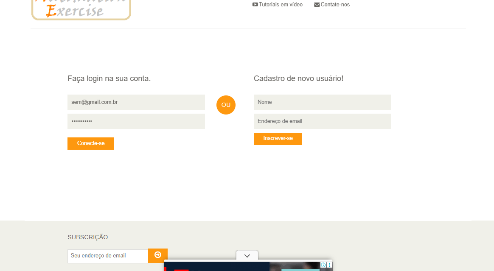
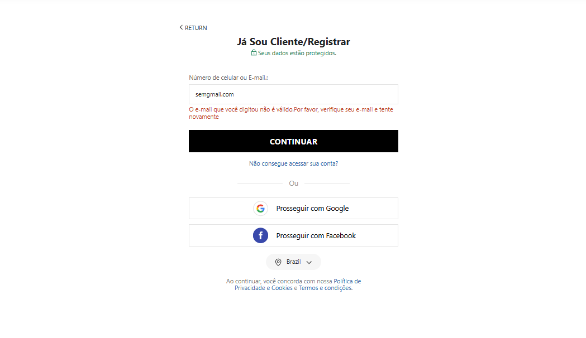
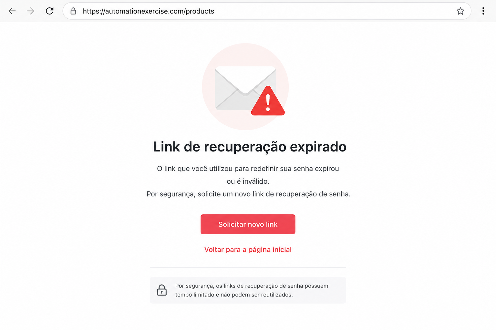
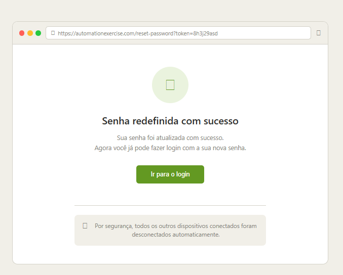
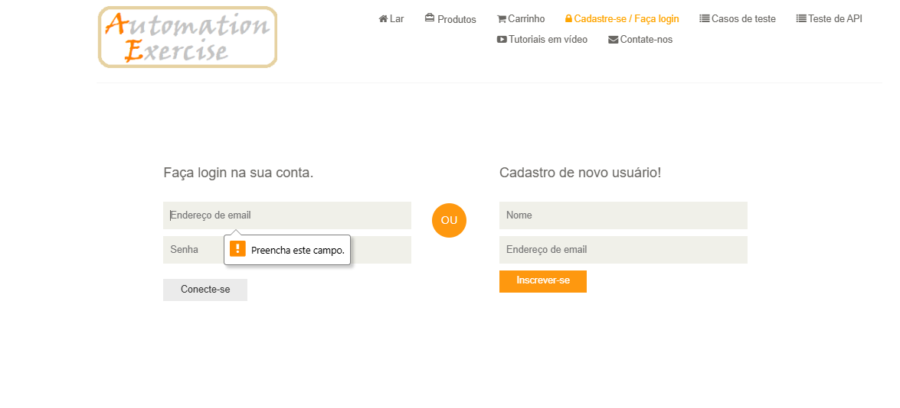

# CT-001 - Recuperacao de e-mail valido

Passos
1. Acessar o siste do Automation Exercise 
2. Clica em recuperar conta 
3. Inserit  um e-mail valido
4. Confirmar solicitação

Resultado Esperado
O sistema deve permitir a recuperação da conta apos inserir os e-mail valido

Resultado Obtido
A conta foi recuperada com sucesso

Status
Passou

# CT-002 - Teste de E-mail invalido

Passos

1. Clicar no campo email e digitar um e-mail 
2. Clicar no botao confirmar 

Resultado esperado
Usurio nao deve conseguir recuperar a conta com informaçoes invalidas 

Resultado obtido 
usuario nao conseguiu realizar a recuperação de conta 

Status
Passou

# CT-003 validar link expirado de recuperação de senha 

Passos

1. Solicitar recuperação de senha
2. receber link no email 
3. aguardar o tempo de expiração do link
4. clicar no link expirado
5. verificar o comportamento do sistema

Resultado esperado
O Sistema deve bloquear a redefinição de senha exibindo menagem de "link espirado" nao permitir alteração de senha antiga

Resultado obitido
Sistema apresentou mensagem "Seu link espirou solicite uma nova recuperação de senha". Usuario nao conseguiu alterar a senha

Status
Passou 

# CT-004 Redefinição de senha 

Observação:
O site Automation Exercise não possui funcionalidade nativa de recuperação de senha.
Os testes abaixo foram simulados com base em comportamentos esperados de mercado para fins de estudo e prática de QA.

Passos
1. Usuario acessa a opçao recuperar senha 
2. Digita o seu e-mail para receber um link para redefinir a senha 
3. Aguarda recero link em seu e-mail
5. O usuário acessa o e-mail cadastrado e clica no link de recuperação de senha, sendo redirecionado para a página de redefinição
6. Ele deve digitar uma nova senha seguindo os padroe que sao exigidos pelo sistema
7. Sistema deve apresentar "Senha alterada com sucesso"

Resultado esperado
Usuario apos acessar o seu e-mail e clicar no link para redefinir a senha, deve ser redirecionado de volta para o sistema onde ira recuperar sua senha digitando uma nova 

Resultado obitido 
Usuario conseguiu realizar a ateração da sua senha para uma senha nova 

Status
Passou

# CT-005 Campos vazios

Passos
1. Usuario nao digita nos campos endereço de e-mail/senha 
2. Usuario deve clicar no campo conectar-se

Resultado esperado
Sistema reconhece que nao foi digitado nada nos campos e solicta que preencha os "Campos invalidos"

Resultado obtido
Sistema retornou que precisa preencher os campo 

Status
Passou

